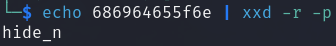
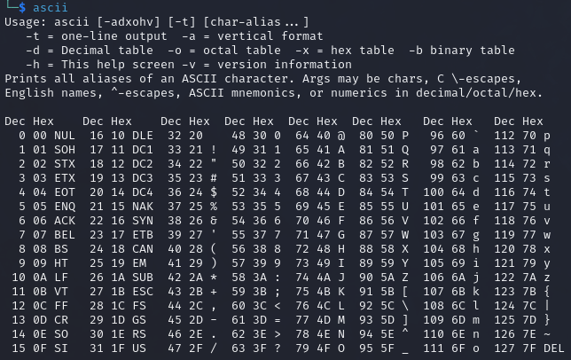

# nathan-on-osu

Description: Here's an old screenshot of chat logs between sahuang and Nathan on hollow's Windows machine, but a crucial part of the conversation seems to be *cropped out*... Can you help to recover the flag from the future?

We're given a zip file that contains a cropped PNG image. Around March 2023, news circulated about the "aCropalypse" - an exploit in screenshot editing tool on the Google Pixel and later discovered to exist on Windows 10 and 11 ( [CVE 2023-21036](https://nvd.nist.gov/vuln/detail/cve-2023-21036) and [CVE 2023-28303](https://msrc.microsoft.com/update-guide/vulnerability/CVE-2023-28303) )

Mindful of this, I immediately searched for any online tools that demonstrate this and came accross [Acropalypse](https://acropalypse.app/), however I had mixed success. Instead of giving a native screen resolution, I tried to give a resolution that should have been enough to reveal the rest of the sentence for the flag (the cropped screenshot dimensions were Width: 1047 Height: 246). This didn't generate a proper image on the website, though if I downloaded the image I received an indication I was on the right track

I could see some distinct Windows elements like the taskbar, so I was confident to keep continuing in this direction and discovered an [Acropalypse Restoration tool](https://github.com/frankthetank-music/Acropalypse-Multi-Tool) that should aid us. After getting the tool up and running, we run into the issue of the tool not running at all as the **dimensions** I'm trying might not be correct. Given that the width of the cropped image in 1047, what happens if we try common screen resolutions that exceed that, say 1920 x 1080?

**Flag:** `osu{cr0pp3d_Future_Candy<3}`

# volatile-map

**Description:** Hey osu! players, our SOC team was informed that a group of spies from Mai Corp is trying to sabotage our infrastructure via their secret map in osu!.

We were able to break into their rendezvous, but they noticed we were stealing their data and they corrupted them in time. Fortunately, we managed to acquire a full memory dump from one of their machines.

Can you help us investigate what they were trying to do?

**Solving Process:** When I see something involving a memory dump, my immediate thought is to turn to [Volatility](https://volatilityfoundation.org/) and for this challenge I made use of Volatility 3 specifically.

After downloading the provided ZIP file and extracting it, I used `windows.pstree` as I (naively) assumed we'd be dealing with a Windows memory dump. If this didn't work, we could determine the profile of the image by using `windows.info`.  I'll note that I did use `windows.pslist` first to list running processes at the time of the memory capture, however there wasn't much that I observed and as such will omit it from here.

Viewing this shorter output we can see that `osu!.exe` has been spawned, as well as `notepad.exe` twice. Being that the theme of this challenge is sabotage and my limited hyper-learning surrounding osu!, I figured it'd be worthwhile to see if there were any commands recently exectued that seemed suspicious. To do this, I used `windows.cmdline` and I specifically looked for anything relating to `notepad.exe` or `osu!.exe` itself.

Immediately on the right hand side of the two `.osu` files, the string `X3NlZWVlZWVlZWVla30=` stands out as a strong candidate as being Base64 encoded. We can immediately test this using [base64](https://linux.die.net/man/1/base64), which is native to most Linux distributions.

 

Those of you more observant might notice that there is still more yet to take from our `windows.cmdline` output from earlier. Unfortunately I skimmed over the rest of the file and spent too much time delving into rabbit holes. I eventually circled back to our two lines of output from `windows.cmdline` and looked a little closer. Is this Hexademical?

 

Finally we (or rather I) observe the start of the flag in the filename and combine all parts together

**Flag:** `osu{hide_n_seeeeeeeeeek}`

# out-of-click

**Description:** I love playing this map but recently I noticed that some of the circles seem off. Can you help me find the **locations** of the *weird* circles?

**Solving Process:** After downloading the provided ZIP file, it appears to contain a beatmap folder that can be used in osu! itself (I don't play, so please excuse any incorrect terminology used), so I spent a ***lot*** of time messing around with the in-game editor in osu! to see if there was something further to glean.

After reaching out for a little help, the process to solve this was *much* easier than I thought. We can observe from the screenshot below that one of the files provided has a different modification date compared to the others.

We can check the [diff](https://man7.org/linux/man-pages/man1/diff.1.html)erence of the modified file and another, untouched file

After spending time investigating modifying beatmap files, I partially understood what we were looking at. These lines appeared to be the hit object syntax which follows as: `x coordinate, y coordinate, time, type, hitSound, objectParams, hitSample` (thanks to [this](https://osu.ppy.sh/wiki/en/Client/File_formats/osu_%28file_format%29) wiki explaining in depth ), which is cool and all, though not super important. The first four values of each line appear as integers, perhaps representing another value? [ASCII](https://man7.org/linux/man-pages/man7/ascii.7.html) always seems [popular](https://www.rapidtables.com/convert/number/ascii-hex-bin-dec-converter.html)

**Flag:** `osu{BTMC_15_mY_G0aT}`